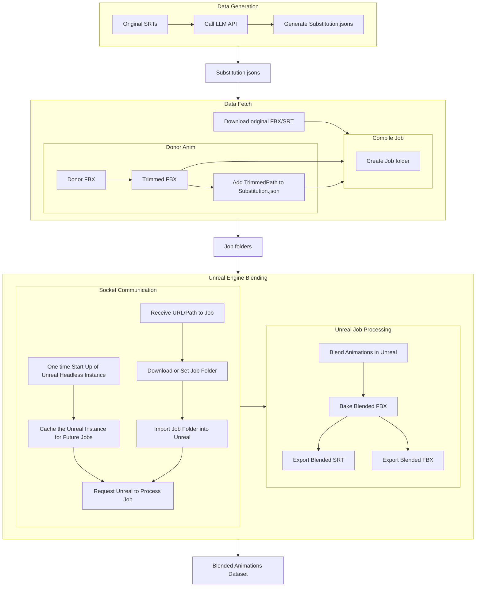

```mermaid
flowchart TD
    subgraph C[Data Generation]
        A0a[Original SRTs] --> A0b[Call LLM API]
        A0b --> A0c[Generate Substitution.jsons]
    end

    C --> D[Substitution.jsons]
    D --> A[Data Fetch]

    subgraph A[Data Fetch]
        A6b[Download original FBX/SRT]
    
        subgraph A5[Donor Anim]
            A5a[Donor FBX] --> A5b[Trimmed FBX]
            A5b --> A5c[Add TrimmedPath to Substitution.json]
        end

        subgraph A6[Compile Job]
            A6a[Create Job folder]
        end

        A6b --> A6
        A5b --> A6
        A5c --> A6
    end

    A --> B[Job folders]
    B --> E[Unreal Engine Blending]

    subgraph E[Unreal Engine Blending]
        subgraph E0[Socket Communication]
            E0z[One time Start Up of Unreal Headless Instance]
            E0y[Cache the Unreal Instance for Future Jobs]
            E0a[Receive URL/Path to Job]
            E0b[Download or Set Job Folder]
            E0c[Import Job Folder into Unreal]
            E0d[Request Unreal to Process Job]

            E0z --> E0y --> E0d
            E0a --> E0b --> E0c --> E0d
        end

        subgraph E1[Unreal Job Processing]
            E1b[Blend Animations in Unreal]
            E1c[Bake Blended FBX]
            E1d[Export Blended SRT]
            E1e[Export Blended FBX]

            E1b --> E1c --> E1d
            E1c --> E1e
        end

        E0 --> E1
    end

    E --> F[Blended Animations Dataset]

```
    