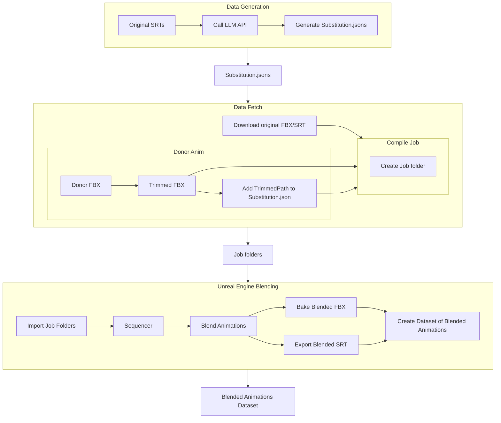

```mermaid
flowchart TD
    subgraph C[Data Generation]
        A0a[Original SRTs] --> A0b[Call LLM API]
        A0b --> A0c[Generate Substitution.jsons]
    end

    C --> D[Substitution.jsons]
    D --> A[Data Fetch]

    subgraph A[Data Fetch]
        A6b[Download original FBX/SRT]
    
        subgraph A5[Donor Anim]
            A5a[Donor FBX] --> A5b[Trimmed FBX]
            A5b --> A5c[Add TrimmedPath to Substitution.json]
        end

        subgraph A6[Compile Job]
            A6a[Create Job folder]
        end

        A6b --> A6
        A5b --> A6
        A5c --> A6
    end

    A --> B[Job folders]
    B --> E[Unreal Engine Blending]

    subgraph E[Unreal Engine Blending]
        E1[Import Job Folders] --> E2[Sequencer] 
        E2 --> E3[Blend Animations]
        E3 --> E4[Bake Blended FBX]
        E3 --> E5[Export Blended SRT]
        E4 --> E6[Create Dataset of Blended Animations]
        E5 --> E6
    end

    E --> F[Blended Animations Dataset]

```
    